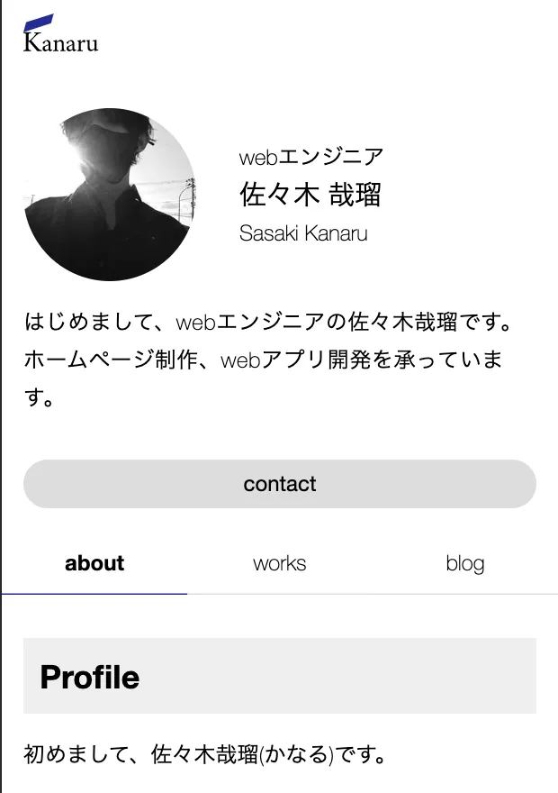

# Kanaru's HomePage

## URL

[https://kanaru.jp](https://kanaru.jp)

## Description

This is Kanaru's HomePage. I created it using NextJS and TypeScript.
The top page, works list page, and blog list page are SPA, and the lower article page is SSG. It use Wordpress, and issues a GraphQL query to fetch the data. The contact form sends an email via SendGrid.

## Site Map

- /
  - /works
    - /[articles]
  - /blog
    - /[articles]
  - /contact

## Technology used

- NextJS
- TypeScript
- TailwindCSS
- GraphQL
- Apollo Client
- WordPress
